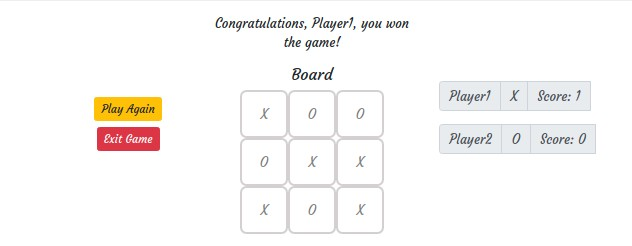

# Tic Tac Toe With Javascript

## Table of Contents

* [About the Project](#about-the-project)
  * [Built With](#built-with)
* [Authors](#authors)
* [Acknowledgments](#acknowledgments)

<!-- ABOUT THE PROJECT -->
## About The Project

In this project, we recreate the game TicTacToe to play in a browser using Javascript. This game is for two players, who take turns for adding the marker 'X' or 'O' in spaces of a 3×3 board. The player who first places three of their marks in a horizontal, vertical, or diagonal row is the winner.

Live version of the project: [Live version](https://rawcdn.githack.com/mcastorena0316/js-tictactoe/77553ba2dc278ab98519ffd0cb98cf8102b6c970/index.html)

Project Link: [JS-TICTACTOE](https://github.com/mcastorena0316/js-tictactoe)

Link for project specifications: [Odin-Project](https://www.theodinproject.com/courses/javascript/lessons/tic-tac-toe-javascript)

### Built With

*   HTML5
*   SCSS
*   Bootstrap
*   Javascript

<!-- CONTACT -->
## Authors

 **Author1**

 MaryAnn Chukwuka
 - Github: [@adaorachi](https://github.com/adaorachi)
 - Linkedin: [MaryAnn Chukwuka](https://www.linkedin.com/in/adaorachi/) 
 
**Author2**

  Melissa Castorena 
- Github: [@mcastorena0316](https://github.com/mcastorena0316)
- Linkedin: [Melissa Castorena](https://www.linkedin.com/in/melissa-castorena/) 

<!-- ACKNOWLEDGEMENTS -->
## Acknowledgments

* [Microverse](https://www.microverse.org/)
